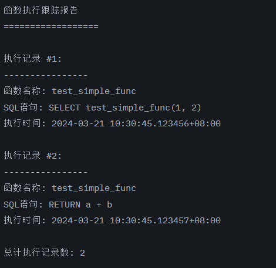

# OpenTenBase核心贡献挑战赛 - 赛题四

# 结果

完成度：

- [x] 每一步调用的指令/SQL文本

- [ ] 每一步调用所在的方法行数

- [x] 每一步调用所在的方法名称

- [ ] 每一步调用时的变量信息

- [x] 每一步触发的时间点

测试用function


测试结果



# 使用文档

pg_trace_tool 是一个用于 OpenTenBase 的函数执行跟踪工具，可以帮助用户跟踪和分析函数与存储过程的执行过程。

## 安装

1. 编译插件：
```bash
cd /path/to/OpenTenBase/contrib/
git clone https://atomgit.com/da_capo_/pg_trace_tool.git
cd pg_trace_tool
make
make install
```

2. 创建扩展：
```sql
CREATE EXTENSION pg_trace_tool;
```

## 使用方法

### 基本用法

1. 创建测试函数 test_simple_func：
```sql
CREATE OR REPLACE FUNCTION test_simple_func(a int, b int)
RETURNS int
LANGUAGE plpgsql
AS $$
BEGIN
    RETURN a + b;
END;
$$;
```

2. 跟踪函数执行：
```sql
SELECT pg_trace_tool('test_simple_func(1, 2)');
```

### 输出

```
函数执行跟踪报告
==================

执行记录 #1:
----------------
函数名称: test_simple_func
SQL语句: SELECT test_simple_func(1, 2)
执行时间: 2024-03-21 10:30:45.123456+08:00

执行记录 #2:
----------------
函数名称: test_simple_func
SQL语句: RETURN a + b
执行时间: 2024-03-21 10:30:45.123457+08:00

总计执行记录数: 2
```

## 示例

### 简单函数跟踪

```sql
-- 创建简单函数
CREATE OR REPLACE FUNCTION test_simple_func(a int, b int)
RETURNS int
LANGUAGE plpgsql
AS $$
BEGIN
    RETURN a + b;
END;
$$;

-- 跟踪函数执行
SELECT pg_trace_tool('test_simple_func(1, 2)');
```

### 复杂函数跟踪

```sql
-- 创建复杂函数
CREATE OR REPLACE FUNCTION test_complex_func()
RETURNS void
LANGUAGE plpgsql
AS $$
BEGIN
    -- 创建临时表
    CREATE TEMP TABLE temp_test (id int, value text);
    
    -- 插入数据
    INSERT INTO temp_test VALUES (1, 'test1');
    INSERT INTO temp_test VALUES (2, 'test2');
    
    -- 查询数据
    SELECT * FROM temp_test;
    
    -- 删除临时表
    DROP TABLE temp_test;
END;
$$;

-- 跟踪函数执行
SELECT pg_trace_tool('test_complex_func()');
```
